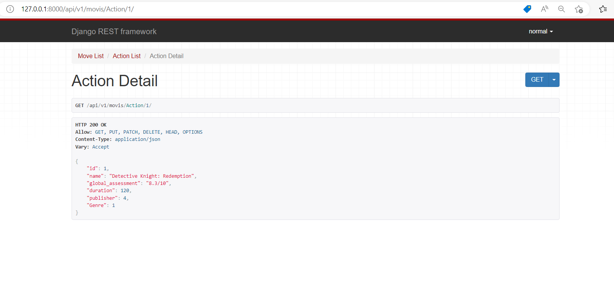

 # LAB - Class 26

## Project: drf-api-permissions-postgres

### Author: Walaa' Atiyh

#### How to initialize/run your application (where applicable)
   
1. **Create the venv and activate it.**

    `python3.10 -m venv .venv`
    `source .venv/bin/activate`

2. **Installing Django.**

    `pip install django`
    `pip install djangorestframework`
    
   or 

   **install  requirements.txt**
   
   `pip3 install -r requirements.txt`

3. **To update the database**

    `python manage.py migrate`

4. **To run the server**

    `python manage.py runserver`

5. **To create an admin user**

    `python manage.py createsuperuser`

6. the admin username in the servers :admin
                 email:admin@admin.com
                 passward :admin1212

##  work with  docker 
  1.  `docker-compose up`
  2.   `docker-compose run web python manage.py migrate`
  3.  `docker-compose run web python manage.py createsuperuser`
  4.  the admin username :admin
                email:admin@admin.com
                passward :admin1212
   5. the normal username :normal
                email:normal@normal.com
                passward :normal121212
  6. the staff username :staff
                email:staff@staff.com
                passward :staff1212

### git the list of the Move List  
   
   `http://127.0.0.1:8000/api/v1/movis/`

  

### git the list of the Action List
   
   `http://127.0.0.1:8000/api/v1/movis/Action/`

  
  

### git the list of the Animation List
   
   `http://127.0.0.1:8000/api/v1/movis/Animation/`

### git the list of the Drama List
   
   `http://127.0.0.1:8000/api/v1/movis/Drama/`

 

### rin the test 
`python manage.py test` 

## [pull requests](https://github.com/WalaaAtiah/drf-api-permissions-postgres/pull/1)
